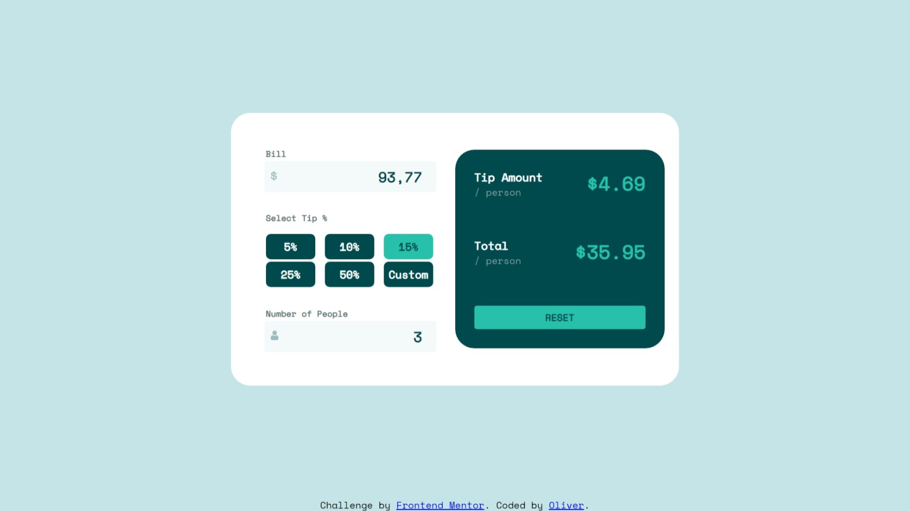
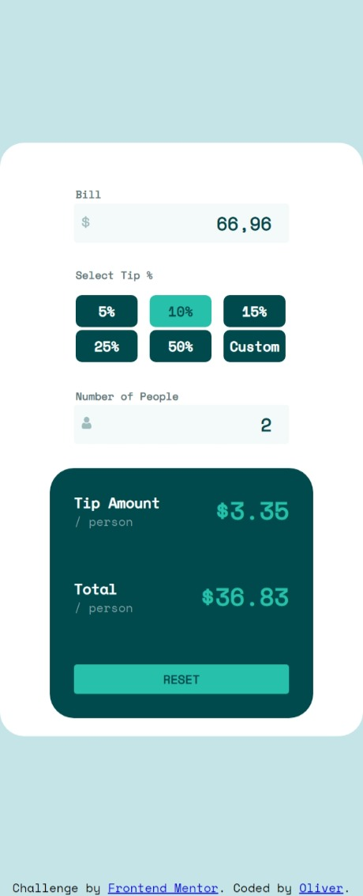

# Frontend Mentor - Tip calculator app solution

This is a solution to the [Tip calculator app challenge on Frontend Mentor](https://www.frontendmentor.io/challenges/tip-calculator-app-ugJNGbJUX). Frontend Mentor challenges help you improve your coding skills by building realistic projects.

## Table of contents

- [Overview](#overview)
  - [The challenge](#the-challenge)
  - [Screenshot](#screenshot)
- [My process](#my-process)
  - [Built with](#built-with)
  - [What I learned](#what-i-learned)
  - [Continued development](#continued-development)
- [Author](#author)

**Note: Delete this note and update the table of contents based on what sections you keep.**

## Overview

### The challenge

Users should be able to:

- View the optimal layout for the app depending on their device's screen size
- See hover states for all interactive elements on the page
- Calculate the correct tip and total cost of the bill per person

### Screenshot

## My process

### Built with

- HTML
- CSS
- Flexbox
- JavaScript

### What I learned

I decided to use no Framework to test my knowledge of basis. I think the JS part is much more complicated than it has to be. I guess I will try to improve that in the future. 

I learned a lot about how Felxbox work. 

### Continued development

As already said above, I will have a closer look onto the JS part and see if I can solve it more elegant. Some bugs need also be solved. 

## Author

- Frontend Mentor - [@opoos-code](https://www.frontendmentor.io/profile/opoos-code)

